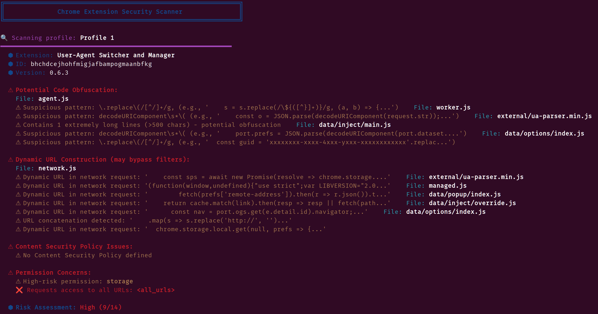

# chrome-extensions-scanner
Antivirus deep scanner for installed chrome extensions to detect requests to suspicious/malicious external URLs, obfuscated code, and unusual permissions.

## Installation & Usage

_Note: Tested on Linux Operating System (Ubuntu, it might work on Mac)_

1. Ensure tools are installed
    * `sudo apt-install -y jq grep sed awk find git`
2. Clone the repository
    * `git clone https://github.com/latheesan-k/chrome-extensions-scanner.git`
3. Allow execution & run the script
    * `chmod +x chrome-extensions-scanner.sh && ./chrome-extensions-scanner.sh`

> Alternatively, you could just download the repo as a zip archive from https://github.com/latheesan-k/chrome-extensions-scanner/archive/refs/heads/main.zip and extract it and follow steps 1 and 3.

## Customizations

* Change the `chrome_dir` variable if Chrome data dir is different on your machine
* You can manage whitelisted domains by modifying the `safe_domains` variable
* You can manage blacklisted TLDs (top level domain) by modifying the `suspicious_tlds` variable

## Disclaimer

Is this perfect? No, but it's better than nothing. This scanner has already helped me identify one extension I was using with relatively simple utility (take full page screenshot), but it had ton of obfuscated code and many external requests, which did not make sense. So I now no longer use that extension - better safe than sorry.

## Want to help?

Feel free to fork the repo, improve it and submit pull requests.
It would be nice to add proper support for Mac and even Windows if possible.
